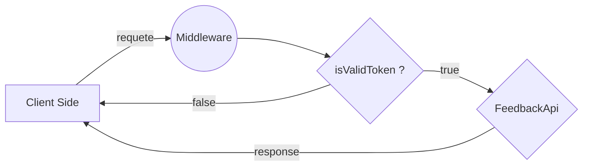

# Bienvenue sur FeedBack-ipssi Backend!

Ce projet est une api qui permet la gestion de données concernant le système de "feedback de l’école Ipssi. l'architecture de base est centre sur quatre schémas de données, desquels différentes actions sont possible.

Dépendamment du token servi a l'utilisateur au moment du login, des droit d'admin, d’élèves ou de prof seront attribues a ce dernier lui permettant l’accès a différentes ressources.


## Entité
	
Cet api permet de communique avec quatre model de base (**user**, **schoolyear**, **module**, **note**) puis deux models qu'on appellera models de référence (**schoolyearOfStudent**, **moduleOfSchoolYear**).

### Users

```
password: {
	type:  String,
	required:  false
},
email: {
	type:  String,
	required:  true
},
last_name: {
	type:  String,
	required:  true
},
first_name: {
	type:  String,
	required:  true
},
role: {
	type:  String,
	enum: ["student", "teacher", "pedagogy", "admin"],
	required:  true
}
```

### SchoolYear
```
name: {
	type:  String,
	required:  true
},
start_date: {
	type:  Date,
	required:  true
},
end_date: {
	type:  Date,
	required:  true
}
```
### Module
```
name: {
	type:  String,
		required:  true,
		unique:  true
},
teacher_id: {
	type:  String,
	required:  true
}
```
### SchoolYearOfStudent
```
student_id: {
	type:  String,
	required:  true
},
school_year_id: {
	type:  String,
	required:  true
}
```

### Note
```
value: {
	type:  Number,
	required:  true
},
student_id: {
	type:  String,
	required:  true
},
module_id: {
	type:  String,
	required:  true
},
comment: {
	type:  String,
	required:  false
}
```
### ModuleOfSchoolYear
```
module_id: {
	type:  String,
	required:  true
},
school_year_id: {
	type:  String,
	required:  true
}
```

## Actions

### /user
**GET**  params  { user_id }
	description - Recupere les/le utilisateur(s) avec user_id == _id
	Request - ``` GET /user```
	Result -  status code: **200**/OK
	```[{
"_id": "5e40294ab76437001ea2a24d",
"password": "$2b$10$4HtR.AgAJByXMtP46tBZpewZEHLAS70pyPNFknhBHUpc.kH6PSeqa",
"email": "admin@admin.com",
"last_name": "adminlastname",
"first_name": "adminfirstname",
"role": "admin"
},
{
"_id": "5e40294ab76437001ea2a24e",
"password": "$2b$10$4HtR.AgAJByXMtP46tBZpewZEHLAS70pyPNFknhBHUpc.kH6PSeqa",
"email": "jacques@teacher.com",
"last_name": "teacher",
"first_name": "jacques",
"role": "teacher"
},...}]```

**POST** body { email, last_name, first_name, role, school_year_id }
	Description - Cree un nouvel utilisateur et le rajoute dans sa la promotion designe.
	Request - ```POST /user``` 
	Result - status code: **201**/Created
	```{ 
"_id": "5e4039f94e1485011815a6a0",
"email": "test",
"last_name": "test", 
"first_name": "test", 
"role": "student",
"__v": 0
  }``` 
  
**DELETE** params { user_id }
Description - Supprime un user avec _id = user_id
Request - ```DELETE /user``` 
Result - status code **200**/OK
```{	"message": "user deleted properly" }```

### /school-year/
**GET** params { school_year_id }
Description - Recupere toutes les promotions avec school_year_id == school_year_id
Request -  ```GET /school-year/```
Result -  status code **200**/OK
```[{
"_id": "5e40411f8503bd0020dfb6fc",
"name": "ESIS-aw",
"start_date": "Thu Oct 01 2020 ",
"end_date": "Sat Oct 01 2022 "
},
{
"_id": "5e40411f8503bd0020dfb6fd",
"name": "ESIS-cs",
"start_date": "Thu Oct 01 2020 ",
"end_date": "Sat Oct 01 2022 "
},
{
"_id": "5e40411f8503bd0020dfb6fe",
"name": "ERAD-aa",
"start_date": "Thu Oct 01 2020 ",
"end_date": "Sat Oct 01 2022 "
},
...]
```

**POST** body { name, start_date, end_date }
Description - Cree une nouvelle promotion
Request - ```POST /school-year``` 
Result - status code **201**/Created
```
{
"_id": "5e40411f8503bd0020dfb6fe",
"name": "ERAD-aa",
"start_date": "Thu Oct 01 2020 ",
"end_date": "Sat Oct 01 2022 "
},
```

**DELETE** params { school_year_id }
Description - Supprime un promotion avec _id = school_year_id
Request - ```DELETE /school-year``` 
Result - status code **200**/OK
```{	"message": "schoolyear deleted properly" }```

**PUT**

### /modules
**GET** params { module_id }
Description - Recupere un module avec _id = module_id dans le cas ou module_id n'existe pas tout les modules seront ramenes.
Request - ```GET /modules``` 
Result - status code **200**/OK
```
[{
"name": "node",
teacher:
	{
		teacher_id: 6a90412f8503bd0020dfb4te
		last_name: teachname,
		first_name: teachfname
	}
},
{
"name": "mongo",
teacher:
	{
		teacher_id: 6a90412f8503bd0020dfb4te
		last_name: teachname,
		first_name: teachfname
	}
},
...]
```

**POST** body { name, teacher_id }
Description - Cree un nouveau module et lui ajoute automatiquement un intervenant. Un module ne pourra pas etre creer sans intervenant attribuer.
Request - ```POST /modules``` 
Result - status code **201**/Created

{
"_id": "5e40411f8503bd0020dfb6fe",
"name": "sql",
"teacher_id": "6a90412f8503bd0020dfb4te",
"end_date": 
},


**DELETE** params { module_id }
Description - Supprime un module avec _id = module_id
Request - ```DELETE /modules``` 
Result - status code **200**/OK
```{	"message": "module deleted properly" }```

### /notes
**GET** 
Description - Recupere les note.
Request - ```GET /notes``` 
Result - status code **200**/OK
```
[{
"_id": "5e4041208503bd0020dfb70e",
"value": 15,
"comment": "Lorem ipsum sic amet",
"student_id": "5e40411f8503bd0020dfb6f8",
"module_id": "5e4041208503bd0020dfb704"
},
{
"_id": "5e4041208503bd0020dfb70f",
"value": 10,
"comment": "Lorem ipsum sic amet",
"student_id": "5e40411f8503bd0020dfb6f8",
"module_id": "5e4041208503bd0020dfb704"
},
{
"_id": "5e4041208503bd0020dfb710",
"value": 18,
"comment": "Lorem ipsum sic amet",
"student_id": "5e40411f8503bd0020dfb6f8",
"module_id": "5e4041208503bd0020dfb704"
},
...]
```

**POST** body { value, comment, student_id, module_id }
Description - attribut une nouvelle note a un module.
Request - ```POST /notes``` 
Result - status code **201**/Created
```{
"_id": "5e4041208503bd0020dfb70e",
"value": 15,
"comment": "Lorem ipsum sic amet",
"student_id": "5e40411f8503bd0020dfb6f8",
"module_id": "5e4041208503bd0020dfb704"
}
```

**DELETE** params { note_id }
Description - Supprime une note avec _id = note_id
Request - ```DELETE /notes``` 
Result - status code **200**/OK
```{	"message": "note deleted properly" }```
<br><br>

les actions mentionnes ci-dessus sont les actions basiques sur lesquelles repose le reste des methods plus complexes presentes dans ce projet.
**user**
```
POST /user/login --> permet a l'utilisateur de recevoir un token et d'acceder a son espace
POST /student_in_year --> ajoute un etudiant dans une promotion
DELETE /student_in_year --> supprime un etudiant d'un promotion
GET /student_in_year --> recupere tout les etudiants d'une certaine promotion 
GET /users/role/:user_role --> recupere les users par le role mentionne
```

**schoolyear**
```
GET /school_year/student/:student_id --> Recupere la promotion dans laquelle un certain etudiant        est inscrit
```
**module**
```
GET /modules/teachers/:teacher_id --> Recupere les modules enseigner par un meme intervenant
POST /module_in_schoolyear/ --> Ajoute un module dans une certaine annee
DELETE /module_in_schoolyear/ --> Supprime un module d'une certaine annee
```


# Sécurité
Pour assure la protection des ressources accessible par l'api, un jwt middleware est mit en place. ce middleware est responsable de la vérification du jeton de session envoyer par le client avec sa requête. 
Lors du login l'utilisateur peu recevoir différent type de jeton (jeton d'admin, jeton d’étudiant ou jeton d'intervenant). ce jeton la déterminera les ressources accessible par l'utilisateur. 



